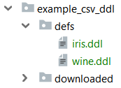

# fprules

*`make`-like file pattern rules for build tools such as `doit`.*

[](https://pypi.python.org/pypi/fprules/) [](https://travis-ci.org/smarie/python-fprules) [](https://smarie.github.io/python-fprules/junit/report.html) [](https://codecov.io/gh/smarie/python-fprules)

[](https://smarie.github.io/python-fprules/) [](https://pypi.python.org/pypi/fprules/) [](https://pepy.tech/project/fprules) [](https://pepy.tech/project/fprules) [](https://github.com/smarie/python-fprules/stargazers)

In GNU `make` there is a powerful concept that many users love for its compacity and expressiveness: so-called "[pattern rules](https://www.gnu.org/software/make/manual/html_node/Pattern-Examples.html#Pattern-Examples)". The concept is extremely simple: 

 - you define a recipe for each file matching a certain pattern, 
 - that recipe typically leads to creating one or more files. The names of these files are created based on the name of the original file 

For example:

```makefile
%.tab.c %.tab.h: %.y
        bison -d $<
```

tells `make` that the recipe `bison -d foo.y` will make both `foo.tab.c` and `foo.tab.h`.

The goal of `fprules` is to provide similar functionality in python, but to decouple it from the build tool itself - so that you can use it in any python task-oriented build tool of your choice, such as [`doit`](https://pydoit.org/).

## Installing

```bash
> pip install fprules
```

## Usage

### 1 source file -> 1 target file

In this fictitious example we have a bunch of `*.ddl` files in a `defs/` folder. 



Each of them contains a URL to a remote csv file. For example you can look at [`iris.ddl`](https://raw.githubusercontent.com/smarie/python-fprules/master/fprules/tests/resources/example_csv_ddl/defs/iris.ddl).

We wish to create a *download task* for each of them, so that the task is named after the `.ddl` file name and the destination of the download is a new `.csv` file under folder `downloaded/`. 

Thanks to `fprules` we can easily generate a to-do list:

```python
from fprules import file_pattern

# define the pattern to create a generator
ddl_task_generator = file_pattern('./defs/*.ddl', './downloaded/%.csv')

# print the contents of the to-do list
for t in ddl_task_generator:
    print(t)
```

yields:

```bash
[iris.ddl] defs/iris.ddl -> downloaded/iris.csv
[wine.ddl] defs/wine.ddl -> downloaded/wine.csv
```

We can then create the tasks with our preferred build tool. For example with [`doit`](https://pydoit.org/) you can create the following `dodo.py` file. Note: the downloading function `download_from_ddl_def` used in this example can be found [here]().

```python
from fprules import file_pattern 
from . import download_from_ddl_def

def task_download_data():
    """
    Downloads file `./downloaded/<dataset>.csv` 
    for each def file `./defs/<dataset>.ddl`.
    """
    for data in file_pattern('./defs/*.ddl', './downloaded/%.csv'):
        yield {
            'name': data.name,
            'file_dep': [data.src_path],
            'actions': [lambda data: download_from_ddl_def(data.src_path, 
                                                           data.dst_path)],
            'verbosity': 2,
            'targets': [data.dst_path]
        }
```

`doit` lists the tasks correctly:

```bash
>>> doit list --all
download_data        Downloads file `./downloaded/<dataset>.csv` for each def file `./defs/<dataset>.ddl`.
download_data:iris   
download_data:wine
```

And execution of the task group works as expected:

```bash
>>> doit download_data
.  download_data:iris
== Downloading file from https://archive.ics.uci.edu/ml/machine-learning-databases/iris/iris.data to downloaded\iris.csv

5.00KB [00:00, 4.86kKB/s]                  

.  download_data:wine
== Downloading file from https://archive.ics.uci.edu/ml/machine-learning-databases/wine/wine.data to downloaded\wine.csv

11.0KB [00:00, 5.43kKB/s]
```

### Patterns syntax

#### Basics

TODO

#### Variable paths

TODO

### 1 source file -> n target files

TODO

## Main features / benefits

TODO

## See Also

Concerning the strategies:

 - The [doit](https://pydoit.org/) task-oriented automation tool

Related stack overflow discussions:

 - TODO

### Others

*Do you like this library ? You might also like [my other python libraries](https://github.com/smarie/OVERVIEW#python)* 

## Want to contribute ?

Details on the github page: [https://github.com/smarie/python-fprules](https://github.com/smarie/python-fprules)
